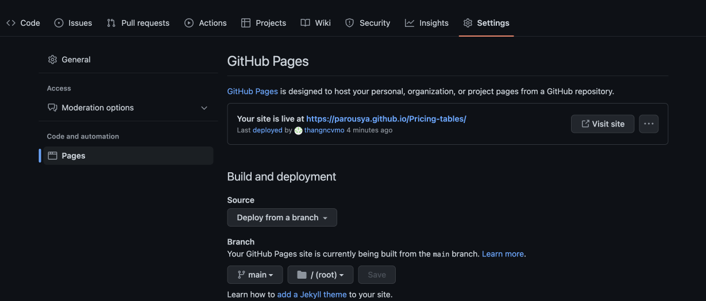

# Pricing-tables
Pricing tables for Parousya subscription plans


# Deploy to Github Page
- Go to Settings > Pages



- Settings Build and deployment

    - Source: `Deploy from A branch`
    - Branch: `main` - `/(root)`

- Save change.

- Go `https://parousya.github.io/Pricing-tables/` to check

# Use
- Add these js files to the header.
```html
<script src="https://parousya.github.io/Pricing-tables/pricing-table.js"></script>
```

- Embed this code where you need to display it.
```html
<pricing-table
  iframe-src="https://parousya.github.io/Pricing-tables/"
  price-api="https://go-api-dev.parousya.com/cms/stripe/prices"
  register-target="https://go-dev.parousya.com/register"
  contact-us-target="https://www.parousya.com/sign-up.html"
>
</pricing-table>
```

- Note: 
    - Attributes are provided according to the environment and are completely mutable.
    - `iframe-src`: Pricing table page link (https://parousya.github.io/Pricing-tables/)
    - `price-api`: Stripe Product Price List API. It is provisioned by the environment, so it depends on the environment you use. Please set the correct value.
    eg: 
      ```shell
      // Production env
      price-api="https://go-api.parousya.com/cms/stripe/prices"
        
      // Staging env
      price-api="https://go-api-stg.parousya.com/cms/stripe/prices"
      
      // Dev env
      price-api="https://go-api-dev.parousya.com/cms/stripe/prices"
      ```
    - `register-target`: Destination when the button is clicked (Not support for Enterprise Plan).
    eg: 
      ```shell
      // Production env
      register-target="https://go.parousya.com/register"
        
      // Staging env
      register-target="https://go-stg.parousya.com/register"
      
      // Dev env
      register-target="https://go-dev.parousya.com/register"
      ```
    - `contact-us-target`: Destination when the button is clicked (Supported for Enterprise Plan).
    eg: 
      ```shell
      // Production env
      contact-us-target="https://www.parousya.com/sign-up.html"
        
      // Staging env
      contact-us-target="https://www.parousya.com/sign-up.html"
      
      // Dev env
      contact-us-target="https://www.parousya.com/sign-up.html"
      ```